

# Ultimate-Battery-Tester
Program for measuring the ESR (equivalent series resistance) of a battery and printing a graph of the values at discharge.

 &nbsp; &nbsp; 

 &nbsp; &nbsp; 

 &nbsp; &nbsp; 

 &nbsp; &nbsp; 

 
 

 

# Features
- **Measures the ESR (equivalent series resistance) of the battery.** This is an indicator of the health of the battery.
- **Stores voltage, current and ESR graph for up to 11 hours as well as capacity in EEPROM** while discharging.
- Current measurement or EEPROM stored measurement graph can be displayed with Arduino Plotter.
- Display of no load voltage to be independence from load (resistor).
- Easy **continuing of interrupted discharge measurements**.
- Display of ESR, voltage, current and capacity on a **1602 LCD**.
- Supports **2 load resistors** for different battery voltages to keep current below 600 mA.
- Supports battery voltages up to 20 volt (@5V Arduino VCC) and external load resistor e.g. for measuring of battery packs.

 

# Li-Ion battery capacity
For Li-Ion the capacity is specified for discharge from **4.2 V to 3.0 V** as in [CGR18650CG Datasheet](https://github.com/ArminJo/Ultimate-Battery-Tester/blob/master/CGR18650CG-Panasonic.pdf)
or to **2.75 V** as in [ICR18650-26A Datasheet](https://github.com/ArminJo/Ultimate-Battery-Tester/blob/master/ICR18650-26A_Samsung.pdf).
The UltimateBatteryTester has a **cut-off voltage of 3.5 V** for Li-Ion to treat the cells with care. 
This results in a reduced capacity displayed by approximately the factor 0.85 (1.18), e.g. a Li-Ion cell with nominal capacity of 2150 mAh at 3 V EOD (End Of Discharge) is measured as 1830 mAh at 3.5 V EOD. 
The cut off voltage can be changed to lower values by connecting pin 11 to ground. See [here](#special-pin-usage).

 

# Battery ESR
The internal resistance is an indicator of the health of the cell. E.g. if a NiMH cell has an ESR of **1 &ohm;**, it delivers **only 1 volt at a current of 200 mA**, which may be to low for the circuit to work properly.
ESR values for NiMH can go down to excellent 0.05 &ohm;. 
Typical ESR value for a 18650 Li-Ion cell is 0.05 &ohm;

It seems that the **dynamic ESR** measured by devices like **YR1035+** is around half as much as the **?static? ESR** measured by this program. 
This was suprising for me, since I expected only a fixed offset, because of connection imperfections.

Arduino plot for a **Li-Ion cell** with nominal 2150 mAh at 3 volt. This plot is done in 2 measurements, modifying the cutoff voltage to 3.0 volt for the second measurement. **The displayed voltage is the "no load" voltage**, to be independent of the current load resistor.

Arduino plot for a **NiMH cell** with 55 m&ohm; ESR.

| Graph of a NiMh battery sold as 4/5AA 1800mAh Ni-Mh proving only 960 mAh |  |
|-|-|
|  |  |
 

# Principle of operation
The battery type is detected by a fixed mapping of voltage to type in `BatteryTypeInfoArray[]`.
While the Mosfet is switched on, the voltage at the 2 &ohm; shunt resistor is measured to get the current. The voltage at the battery terminal is measured to get the voltage under load. 
Every second, the Mosfet is deactivated for 10 ms or 100 ms (depending of battery type), the "no load" voltage at the battery terminal is measured and the Mosfet is switched on again. 
The internal resistance can now be computed from the difference of the load and the no load voltage and the difference of the currents (measured mA and 0 mA).

Every minute, current data is stored/appended to EEPROM. **The complete data is printed in Arduino Plotter format at each reboot**.
So it is possible to interrupt the measurement or switch it off after the measurement is finished, without loosing data.
More details can be found [below](#modes-of-measurement).

 

# Measurement of battery packs with external load resistor
Battery packs up to 17.2 volt (4s) can be measured too. Voltages above 14 volt require a 5 volt supply of the arduino. 
Since the build in load resistor is 12 &ohm;, **the current can go up to 1.4 ampere and the power to 24 watt** and leaving 2.8 watt at the 2 &ohm; shunt resistors. 
This is too much for the resistors I used for shunt! A solution is to **add an additional resistor of around 20 &ohm; in series to the 10 &ohm; aready built in 10 &ohm; one**.
This reduces the current to around 500 mA and power to 9 watt leaving 1 watt at the 2 &ohm; shunt resistors. 
No other adaptions has to be made.

 

# Compile with the Arduino IDE
Download and extract the repository. In the Arduino IDE open the sketch with File -> Open... and select the UltimateBatteryTester folder. 

# Pictures

| Overview | Top View |
|-|-|
| 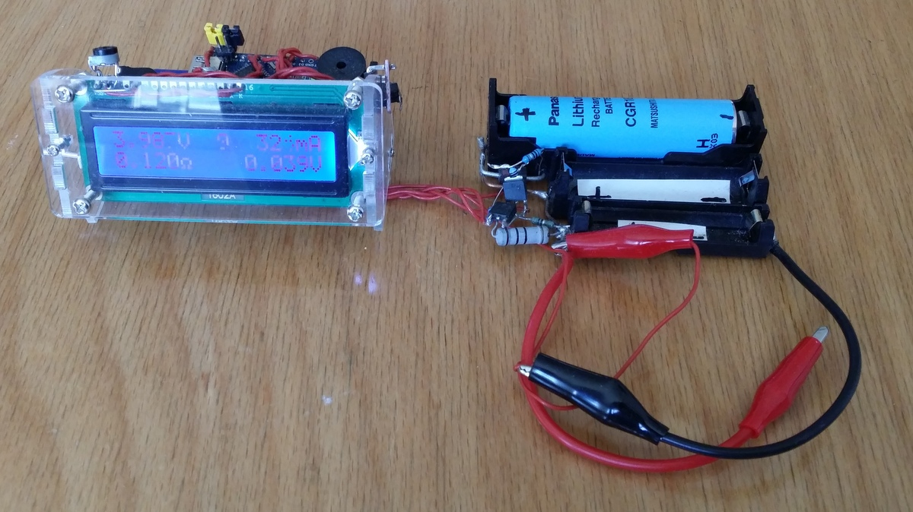 | 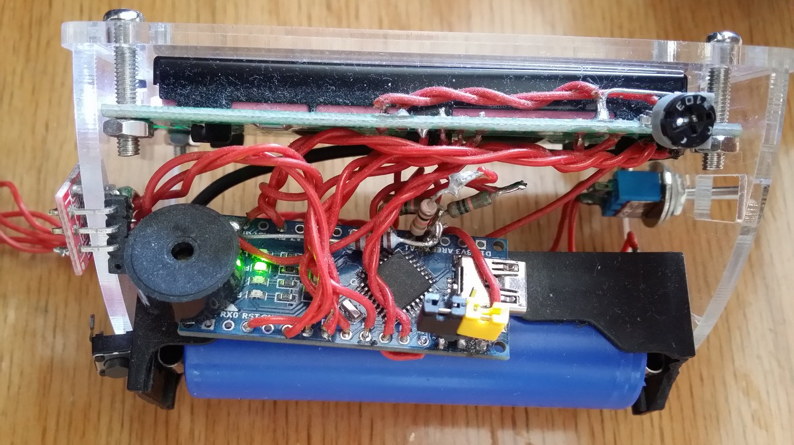 |
| MosFets | Reset and application sensor button |
| 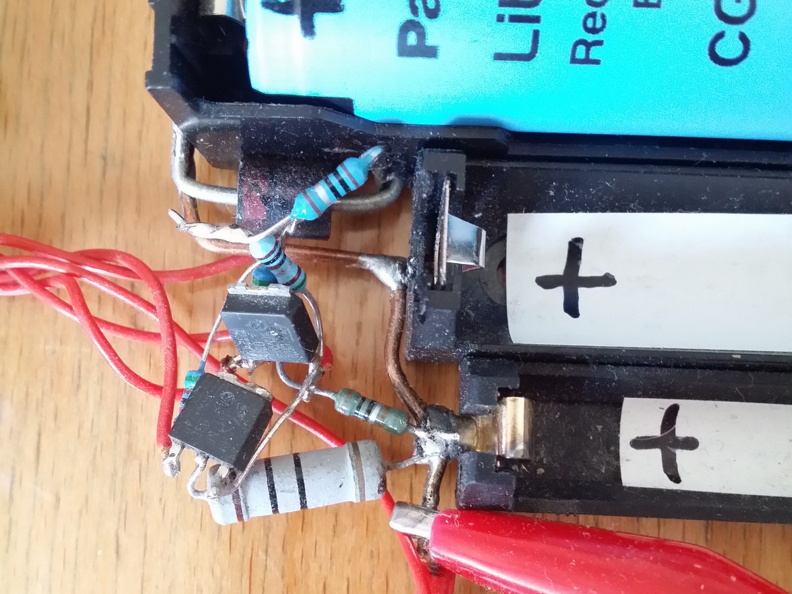 |  |
| Battery holder top view | Battery holder bottom view |
| 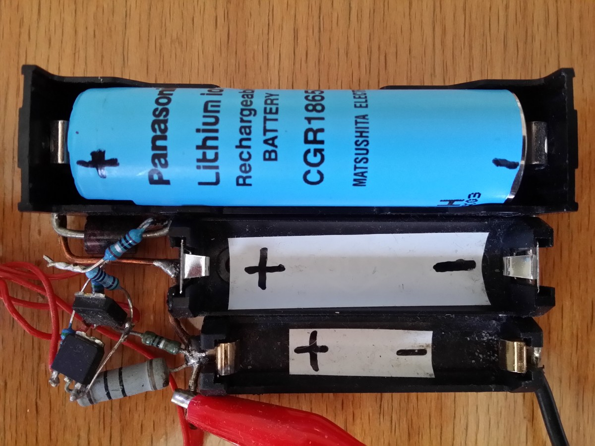 | 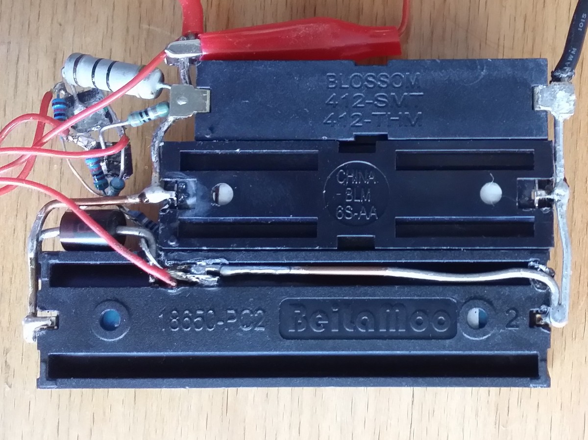 |

# Schematics

# Special pin usage
If pin 10 is connected to ground, verbose output for Arduino Serial Monitor is enabled. Verbose output is not suitable for Arduino Plotter. 
If pin 11 is connected to ground, "cut off is low" is displayed and discharge ends at a lower voltage. E.g. Li-ion discharge ends at 3000 mV instead of 3500 mV.

# Examples on Wokwi
The screenshots below are taken from this [Wokwi example](https://wokwi.com/projects/381051341790948353).

# Modes of measurement
After reset the tester starts with mode Setup:

## Mode Setup
After boot, the tester displays its name and version and date for 2 seconds.

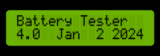

The message "No plotter out" is displayed in the second row for 2 seconds. If pin `PIN_ONLY_PLOTTER_OUTPUT` (pin 10) is held low, then the message "Only plotter out" is displayed.

Then it prints the data read from EEPROM to serial monitor and displays ESR and capacity.
The Arduino supply voltage (VCC) together with the message "Stored data" is displayed in the first row for 2 seconds.

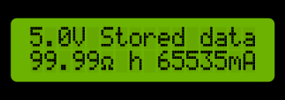

Then the message "cutoff high" or "low"  and the cutoff voltage is displayed in the first row for 2 seconds. On startup, it is the cutoff voltage for the battery type stored last in EEPROM.

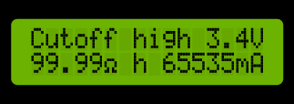
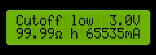

and then mode is **switched to DetectingBattery**.
A double press during 2 seconds always displays `Stop measurement` for 2 seconds and then **switches to mode Stopped**. Another press will start again.

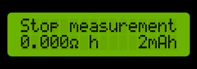

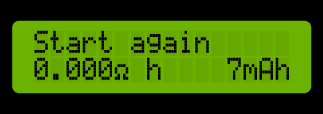

## Mode DetectingBattery
If no battery is inserted, the Arduino supply voltage (VCC) together with the message "No batt." is displayed in the first row until a battery is inserted.

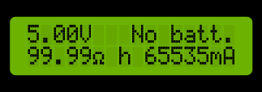

If a battery is inserted, you see e.g.

for 2 seconds.
**From now on, the start/stop button is enabled.** 
Then the messages "dbl press = stop",  and "Press button to append to EEPROM" are displayed for 2 seconds each, but only once after boot.

After this, the mode is **switched to InitialESRMeasurement**.

## Mode InitialESRMeasurement
This mode lasts for 30 seconds before a new measurement is initiated and **mode is switched StoreToEEPROM**. 
This 30 seconds can be used to quick check a battery, without overwriting the already stores values. 
A button press during the 30 seconds **switches directly to mode StoreToEEPROM and appends to already stored EEPROM data**, instead of starting a new measurement.
This enables it to connect the tester to the Arduino Serial Plotter at any time in the measurement without loosing data already acquired.
Because connecting to the Serial Plotter always resets the tester, we must be able to avoid to start a fresh measurement after reset.

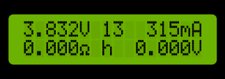

In the first row the **no load voltage** of the battery, the **30 second countdown** and the **load current** is displayed.
In the second row the **ESR** and the **difference between the load and no load voltage**, used to compute the ESR, is dispayed. 
A value of **59.999 &ohm; indicates overflow** over the maximum value of 65.535 &ohm;.

## Mode StoreToEEPROM
- Every second, a sample is taken and displayed.
- Every 60 seconds the sample is stored.
- For the first 337 samples (5:37 hours) each delta is stored to EEPROM.
- After the first 337 samples, all data are compressed, and every 120 seconds 2 compressed samples are stored to EEPROM.
- The number between the voltage and the current in the first row is the EEPROM storage index and incremented at each storage.
If the no load voltage drops below the cut off voltage or the start/stop button is pressed displays `Capacity stored` for 2 seconds,
writes the current capacity to EEPROM and **switches to mode Stopped**.

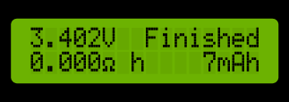
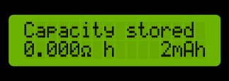

## Mode Stopped
The battery no load voltage is displayed in the first row. "Finished" is displayed after reaching the cutoff voltage,
"Stopped" is displayed after manual stopping by double press.

and **switches to mode DetectingBattery**.

## Cutoff display
If the state of the `PIN_DISCHARGE_TO_LOW` pin changes, the message "cutoff high" or "low"
and the according cutoff voltage is displayed in the first row for 2 seconds.

# Revision History
### Version 3.2.0
- Cutoff message improved.

### Version 3.1.0
- Fixed "conversion does not clear rest of EEPROM" bug.

### Version 3.0.0
- Improved compression.
- Attention by short beep each minute in STATE_DETECTING_BATTERY.

### Version 2.2.0
- ESR > 64 bug fixed.
- Display of changes on pin PIN_DISCHARGE_TO_LOW.

### Version 2.1.0
- ESR is stored and not computed any more.

### Version 2.0.0
- Improved version.

### Version 1.0.0
- Initial version with EEPROM storage.

#### If you find this program useful, please give it a star.
