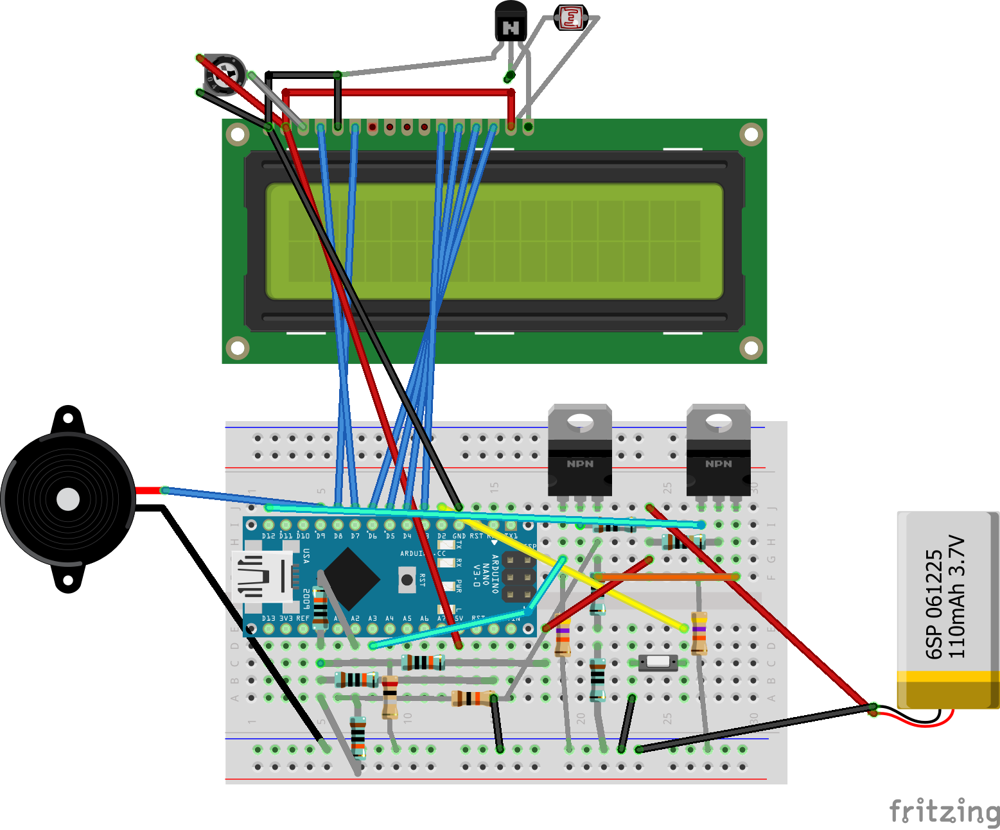

# [Ultimate-Battery-Tester](https://github.com/ArminJo/Ultimate-Battery-Tester)
### Version 1.1.0
[](https://www.gnu.org/licenses/gpl-3.0)
[](https://github.com/ArminJo/Ultimate-Battery-Tester/actions)


## Features
- **Measures the ESR (equivalent series resistance) of the battery.** This is an idicator of the health of the battery.
- Stores voltage and ESR graph for up to 8 hours in EEPROM while discharging.
- Current measurement or EEPROM stored measurement graph can be displayed with Arduino Plotter.
- You can continue interrupted dicharge measurements.
- Display of ESR, voltage, current and capacity on a 1602 LCD.

## Battery ESR
The internal resistance is an idicator of the health of the battery. E.g. if a NiMH battery has an ESR of **1 &ohm;**, it delivers **only 1 volt at a current of 200 mA**, which may be to low for the circuit to work properly.
ESR values for NiMH can go down to excellent 0.05 &ohm;.

Arduino plot for a good battery with 120 m&ohm; ESR.


## Compile with the Arduino IDE
Download and extract the repository. In the Arduino IDE open the sketch with File -> Open... and select the UltimateBatteryTester folder. 




## Modes of measurement
After reset the tester starts with mode Setup:

### Mode Setup
This mode lasts for 6 seconds before **mode InitialESRMeasurement** starts.<br/>
After boot, the tester displays its name and version and date for 2 seconds.

```
Battery Tester
1.1 Feb 17 2022
```
Then it prints the data read from EEPROM to serial monitor and displays ESR and capacity for 4 seconds.
The Arduino supply voltage (VCC) together with the message "Stored data" is displayed in the first row for 2 seconds.
Then the message "dbl press = stop" is displayed for another 2 seconds.

<pre>
4.8V Stored data
0.222&ohm;   1212mAh
</pre>
<pre>
dbl press = stop
0.222&ohm;   1212mAh
</pre>

### Mode DetectingBattery
If no battery is attached, you see:

<pre>
0.000V
0.222&ohm;  No batt.
</pre>

If a battery is attached, you see e.g.

```
1.247V
NiCd NiMH found
```
for 2 seconds and then mode is **switched to InitialESRMeasurement**.

### Mode InitialESRMeasurement
This mode lasts for 30 seconds before a new measurement is initiated and **mode is switched StoreToEEPROM**.<br/>
This 30 seconds can be used to quick check a battery, without overwriting the already stores values.<br/>
A button press during the 30 seconds **switches directly to mode StoreToEEPROM** but appends to already stored EEPROM data instead of initiating a new measurement.
This enables to connect the tester to the Arduino Serial Plotter at any time in the measurement without loosing data already acquired.
Because connecting to the Serial Plotter always resets the tester, we must be able to avoid to start a fresh measurement after reset.

<pre>
1.247V 12 331mA
0.688&ohm;   0.228V
</pre>

In the first row the **no load voltage** of the battery, the **30 second countdown** and the **load current** is displayed.
In the second row the **ESR** and the **difference between the load and no load voltage**, used to compute the ESR, is dispayed.

### Mode StoreToEEPROM
- Every second, a sample is taken and displayed.
- Every 30 seconds the sample is stored.
- Every 60 seconds 2 compressed samples are stored in EEPROM.
A button press displays `Capacity stored` for 2 seconds, writes the current capacity to EEPROM and **switches to mode Stopped**.

### Mode Stopped
The battery no load voltage is displayed in the first row.
A press of the start/stop button **switches to mode InitialESRMeasurement**.

A double press during 2 seconds always displays `Stop measurement` for 2 seconds and then **switches to mode Stopped**.

# Special pin usage
PIN_SERIAL_MONITOR_OUTPUT   11     // If connected to ground, verbose output for Arduino Serial Monitor is enabled. Verbose output is not suitable for Arduino Plotter.


# Revision History
### Version 1.1.0
- Improved version.

### Version 1.0.0
- Initial version with EEPROM storage.

#### If you find this library useful, please give it a star.
